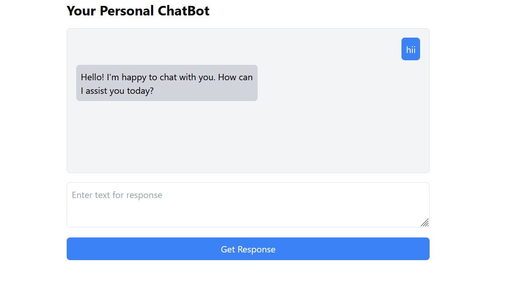

# CloudMind: AI-Powered Chatbot

**CloudMind** is a state-of-the-art chatbot built using Cloud AI, powered by Rapid API. It leverages advanced language models to provide interactive, intelligent, and context-aware conversations. The chatbot is designed to handle user inputs and respond in real-time, making it suitable for a wide range of applications, from customer service to personal assistants.

The integration with Cloud AI allows **CloudMind** to generate highly accurate and human-like responses, while Rapid API provides seamless connectivity to external data sources and functionalities, enhancing the chatbot's ability to handle complex queries.



## Key Features
- **Real-time Conversations**: Engages in dynamic conversations with users, providing instant responses.
- **Cloud AI Integration**: Built using advanced AI models hosted on the cloud for superior language understanding.
- **Rapid API**: Uses Rapid API to enhance the chatbot’s ability to interact with external services.
- **Customizable**: Easily modifiable to suit different use cases like customer support, virtual assistants, and more.

## Getting Started

First, run the development server:

```bash
npm run dev
# or
yarn dev
# or
pnpm dev
# or
bun dev
